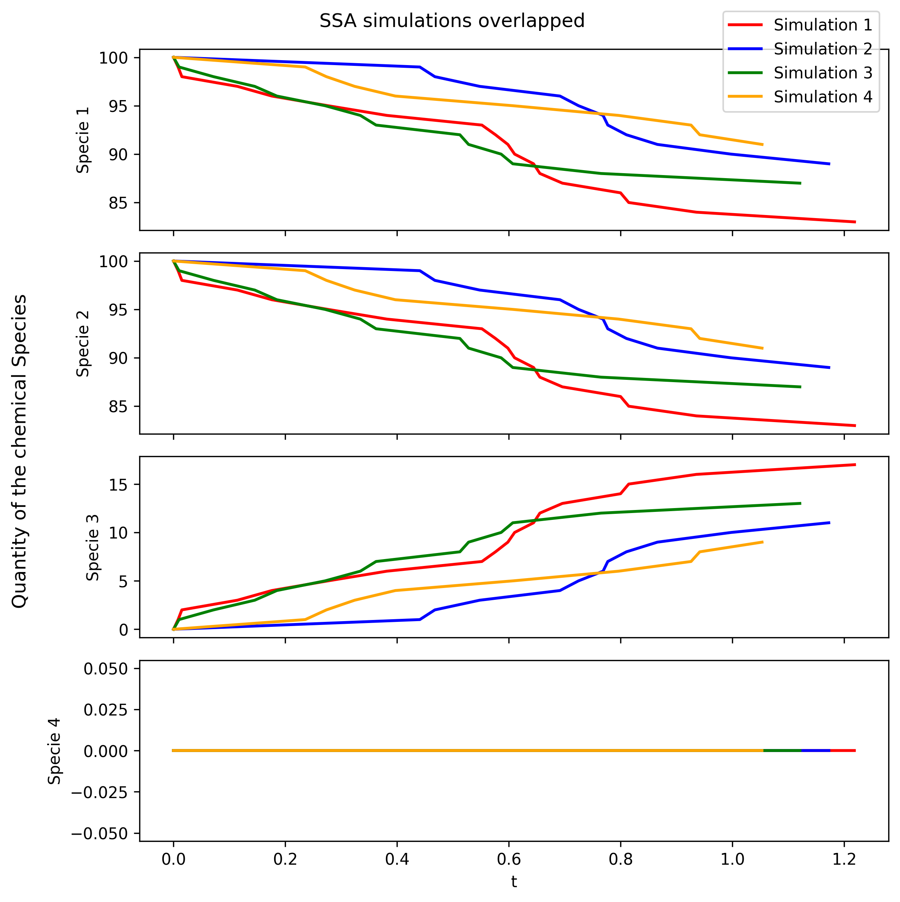
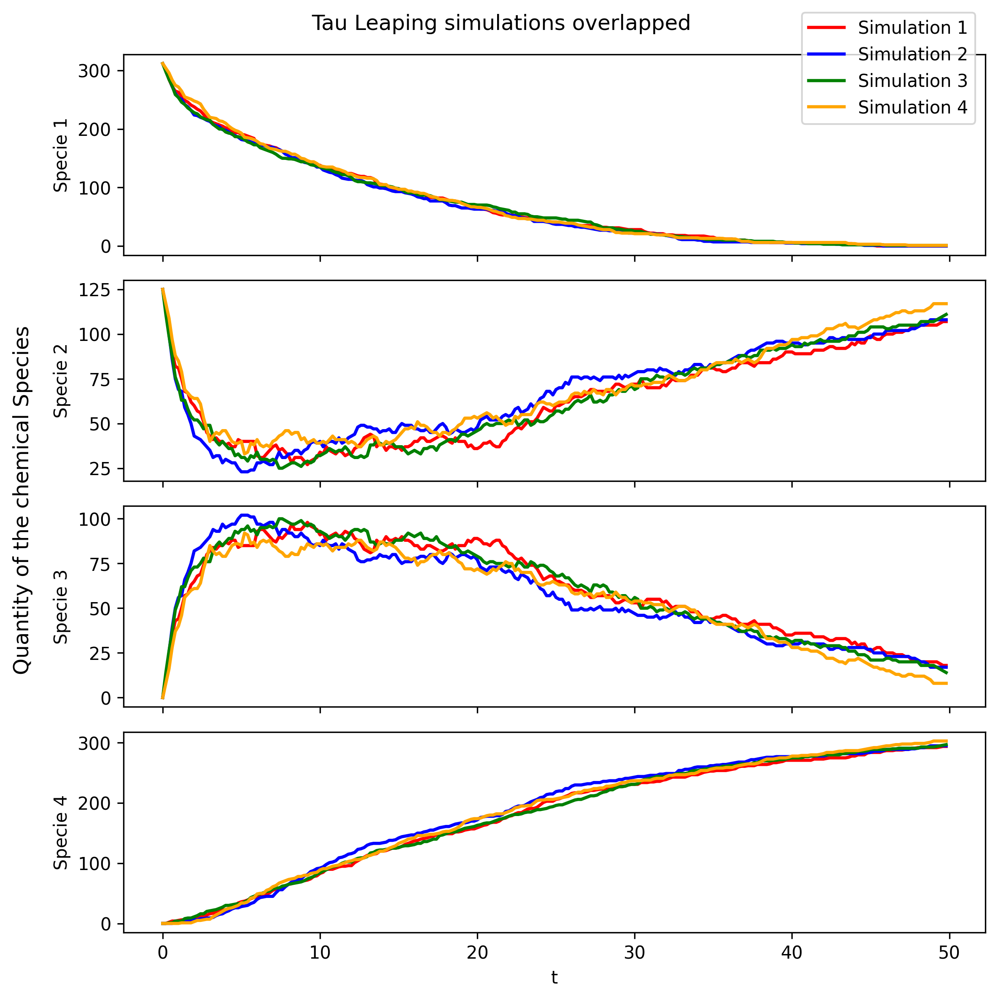
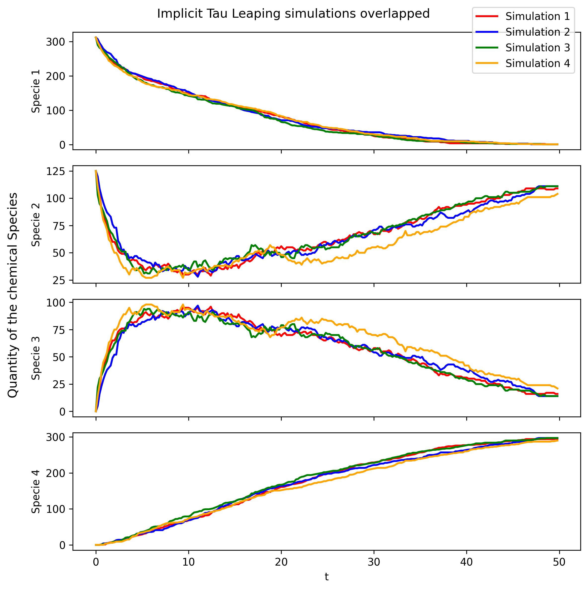
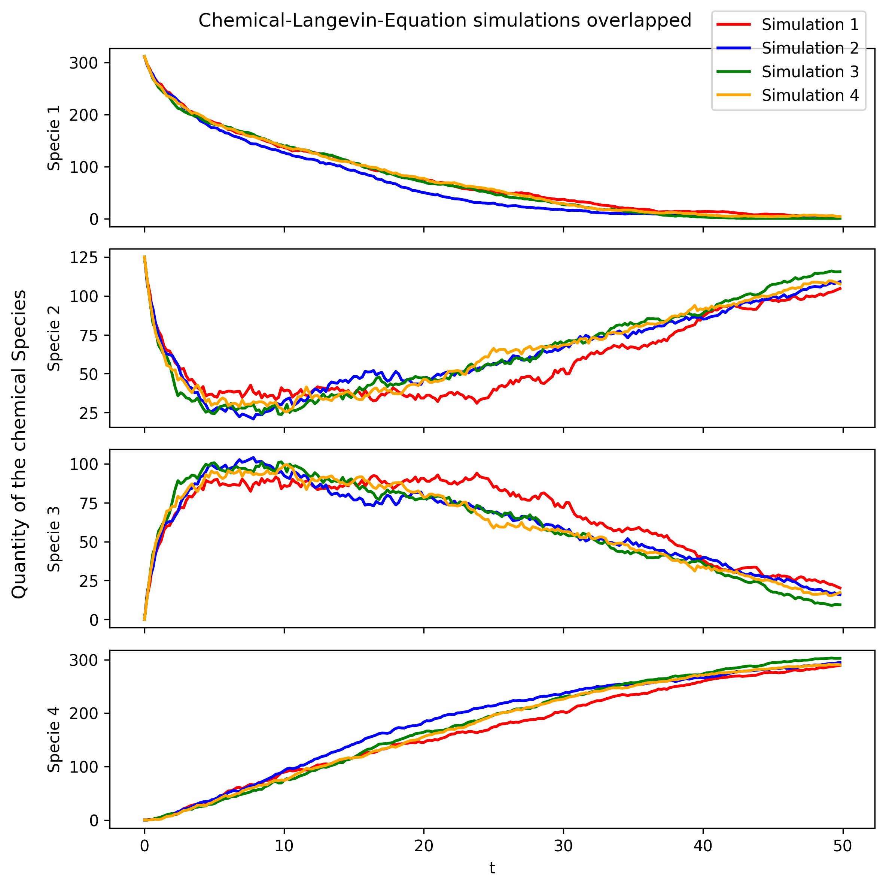

# Efficient Simulation of Stochastic Reaction Networks

Numerical simulation and Monte Carlo analysis of **stochastic chemical reaction networks**, including exact simulation, approximate time-stepping methods and rare-event variance reduction.

This project was developed for **Stochastic Simulation (MATH-414) at EPFL**.

The implementation covers:

- Stochastic Simulation Algorithm (SSA);
- crude Monte Carlo estimation;
- importance sampling for rare events;
- explicit tau-leaping;
- implicit tau-leaping;
- Chemical Langevin Equation;
- Euler-Maruyama discretization;
- Monte Carlo confidence intervals and convergence experiments.

## Overview

Stochastic reaction networks model systems in which the state changes through randomly occurring reaction events.

Exact simulation can accurately reproduce the underlying continuous-time Markov jump process, but it can become computationally demanding when reaction activity is high or when large Monte Carlo samples are required.

This project investigates both **exact and approximate simulation methods** and studies how Monte Carlo techniques can be used to estimate quantities of interest.

A particular focus is placed on **rare-event estimation**, where ordinary Monte Carlo can become extremely inefficient.

## Simulation Methods

### Stochastic Simulation Algorithm

The **Stochastic Simulation Algorithm (SSA)** is implemented as the exact baseline.

At each step, the algorithm:

1. evaluates the reaction propensities;
2. samples the waiting time to the next reaction;
3. samples which reaction occurs;
4. updates the state according to the corresponding stoichiometric vector.

This produces exact sample paths of the stochastic reaction network under the model assumptions.



## Monte Carlo Estimation

Repeated independent simulations are used to estimate expectations of quantities of interest.

The project studies how the estimator changes as the number of Monte Carlo samples increases and constructs normal-approximation confidence intervals from the estimated sampling variance.

For example, the notebook studies quantities such as:

```text
E[X4(T)]
```

and analyzes convergence as the simulation budget increases.

## Rare-Event Estimation

One of the main experiments estimates the rare-event probability:

```text
P(S3(T) > 22)
```

### Crude Monte Carlo

Under the original process, the event is sufficiently rare that ordinary Monte Carlo observes almost no positive samples.

With:

```text
N = 100,000
```

simulations, crude Monte Carlo observed the event only **2 times**, producing:

```text
Estimate ≈ 2.0e-5
Estimator variance ≈ 2.00e-10
```

This illustrates a fundamental problem with naive Monte Carlo for rare events: most of the computational effort is spent generating samples that contribute zero to the estimator.

## Importance Sampling

To improve rare-event estimation, the simulation distribution is modified so that the target event occurs more frequently.

A likelihood-ratio correction is then applied to recover an estimate under the original stochastic process.

The implementation constructs the importance weight from the likelihood ratio between:

- the original reaction process with parameters `c`;
- a modified process with parameters `c_tilde`.

For the rare-event experiment:

```text
c       = [0.001, 0.005, 0.01]
c_tilde = [0.0025, 0.01, 0.01]
N       = 100000
```

The importance-sampling experiment produced approximately:

```text
Rare-event probability estimate: 2.604e-5
Estimator variance:              4.986e-14
95% CI:                          [2.561e-5, 2.646e-5]
```

The event occurred **31,130 times under the importance-sampling proposal**, compared with only 2 observations in 100,000 crude Monte Carlo simulations under the original process.

Comparing the estimator variances gives a reduction of roughly **4,000×**, demonstrating how strongly importance sampling can improve rare-event estimation.

## Explicit Tau-Leaping

The project also implements **explicit tau-leaping** as an approximation to exact SSA.

Instead of simulating reactions one at a time, the method advances the system by a fixed interval `tau` and samples the number of occurrences of each reaction from Poisson distributions.

Conceptually:

```text
Exact SSA
    |
    | simulate one reaction at a time
    v

Explicit Tau-Leaping
    |
    | approximate many reactions over Δt = tau
    v

fewer simulation steps
```

This can substantially reduce the number of simulation steps required when the leap condition is appropriate.



## Implicit Tau-Leaping

An **implicit tau-leaping** scheme is implemented for situations where an explicit method may be less numerically stable.

The intermediate state is defined implicitly through a nonlinear system.

The implementation solves this system numerically while enforcing non-negativity constraints to avoid non-physical intermediate states.



## Chemical Langevin Equation

The discrete reaction network is also approximated by the **Chemical Langevin Equation (CLE)**.

The CLE replaces the jump process with a stochastic differential equation that combines:

- deterministic reaction drift;
- stochastic diffusion terms.

The resulting SDE is discretized using the **Euler-Maruyama method**.



## Experimental Pipeline

```text
Stochastic reaction network
            |
            v
     Reaction propensities
            |
     +------+------+----------------+
     |             |                |
     v             v                v
    SSA       Tau-Leaping          CLE
   exact       approximate      diffusion approx.
     |        /         \             |
     |   explicit     implicit        |
     |                              Euler-
     |                             Maruyama
     +-------------+------------------+
                   |
                   v
            Monte Carlo runs
                   |
          +--------+---------+
          |                  |
          v                  v
   expectation / CI      rare event
                              |
                       +------+------+
                       |             |
                       v             v
                     CMC      Importance Sampling
```

## Key Technical Components

### Exact Event-Driven Simulation

SSA models individual reaction events directly and provides the exact reference simulation method.

### Approximate Time Stepping

Explicit and implicit tau-leaping trade exact event-by-event simulation for larger time steps containing multiple reaction events.

### Stochastic Differential Equations

The Chemical Langevin Equation provides a continuous approximation to the underlying jump process and is simulated using Euler-Maruyama.

### Monte Carlo Inference

Repeated simulation is used to estimate quantities of interest and construct confidence intervals.

### Rare-Event Variance Reduction

Importance sampling deliberately changes the simulation distribution and corrects the resulting samples through likelihood-ratio weights.

This makes otherwise extremely rare events much more frequently observable.

## Main Takeaways

- Implemented an **exact SSA simulator** for stochastic reaction networks.
- Implemented both **explicit and implicit tau-leaping** methods.
- Simulated the **Chemical Langevin Equation with Euler-Maruyama**.
- Built reusable Monte Carlo routines for expectations, estimator variance and confidence intervals.
- Implemented likelihood-ratio **importance sampling** for rare-event probability estimation.
- Reduced rare-event estimator variance by roughly **4,000×** relative to crude Monte Carlo in the studied experiment.
- Compared exact and approximate stochastic simulation approaches across multiple numerical experiments.

## Repository Structure

```text
Stochastic-Simulation/
├── CLE_MC_vs_N.png
├── EM_sim.png
├── ETL_MC_vs_N.png
├── ITL_MC_vs_N.png
├── ITL_sim.png
├── README.md
├── Report.pdf
├── SRN_code.ipynb
├── SSA_MC_N.png
├── SSA_MC_large_N.png
├── SSA_sim.png
├── SSA_sim_2.png
├── SSA_sim_2_c_tilde.png
└── TL_sim.png
```

### `SRN_code.ipynb`

Contains the implementation and numerical experiments for:

- SSA;
- crude Monte Carlo;
- importance sampling;
- explicit tau-leaping;
- implicit tau-leaping;
- Chemical Langevin Equation;
- Euler-Maruyama;
- convergence experiments and visualizations.

### `Report.pdf`

Contains the accompanying derivations, methodology and discussion of the numerical results.

### Figures

The repository includes simulation trajectories and Monte Carlo convergence plots generated during the experiments.

## Running the Project

A minimal Python environment requires:

```bash
pip install numpy scipy matplotlib jupyter
```

Then launch:

```bash
jupyter notebook SRN_code.ipynb
```

The notebook contains the simulation methods and experiments used to generate the figures included in this repository.

## Context

This project was completed as part of:

**MATH-414 — Stochastic Simulation**  
École polytechnique fédérale de Lausanne (EPFL), 2025.

The project focuses on stochastic-process simulation, numerical approximation, Monte Carlo inference and variance reduction for rare events.